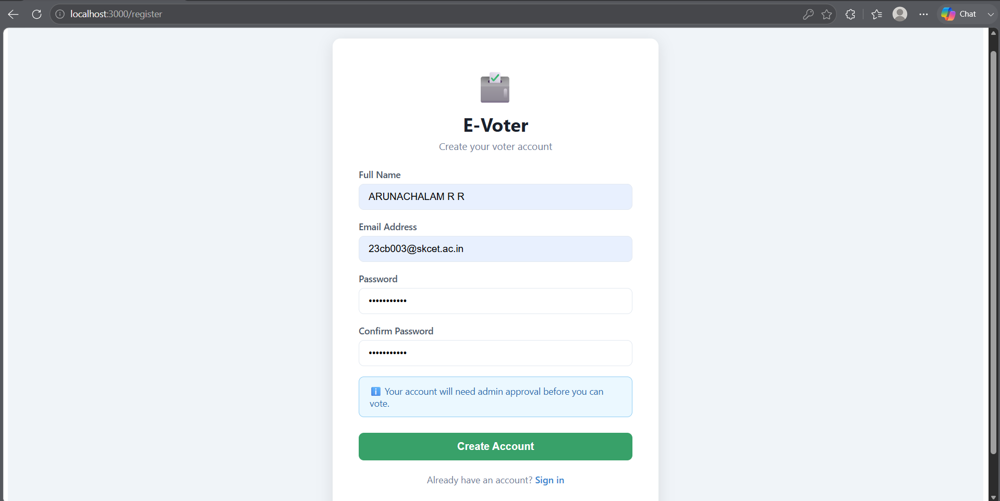
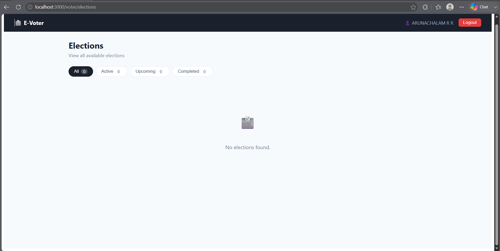
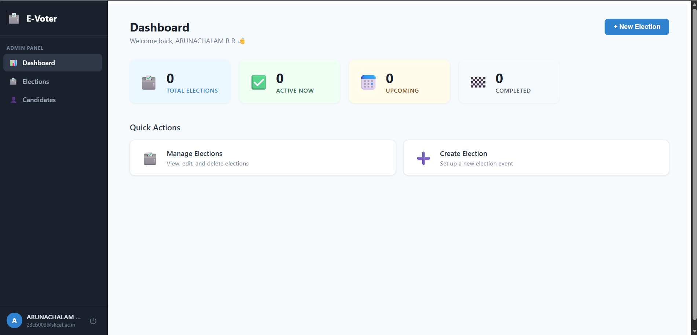

# 🗳️ E-Voter

A secure online voting platform built using **Spring Boot**, **React**, **Spring Security**, **JWT Authentication**, and **MySQL**.

The system enables administrators to manage elections, verify voters, monitor election activity, and publish results, while allowing verified users to participate in elections securely from anywhere.

---

## 🚀 Features

### 👤 Authentication & Authorization

* User Registration
* User Login
* JWT Authentication
* Role-Based Access Control (Admin & Voter)
* BCrypt Password Encryption

### 🗳️ Election Management

* Create Elections
* Update Elections
* Delete Elections
* Manage Election Status
* View Election Statistics

### 🧑‍💼 Candidate Management

* Add Candidates
* Update Candidate Profiles
* Delete Candidates
* Assign Candidates to Elections

### ✅ Voting System

* Secure Vote Casting
* One Vote Per Election
* Real-Time Vote Tracking
* Election Result Calculation

### 👨‍💻 Admin Features

* Verify Voter Accounts
* Manage Elections
* Manage Candidates
* View Election Analytics
* Publish Results

### 📊 Result Management

* Real-Time Vote Counts
* Winner Determination
* Election Statistics Dashboard

---

## 🏗️ System Architecture

```text
React Frontend
      │
      ▼
Spring Boot REST APIs
      │
      ▼
Spring Security + JWT
      │
      ▼
MySQL Database
```

---

## 🛠️ Technology Stack

### Backend

* Java 17
* Spring Boot
* Spring Security
* JWT Authentication
* Spring Data JPA
* Hibernate
* Maven

### Frontend

* React
* React Router
* Axios
* Context API

### Database

* MySQL

### Tools

* Git
* GitHub
* Postman
* IntelliJ IDEA
* VS Code

---

## 📂 Project Structure

```text
E-Voter
│
├── backend/
│   ├── controllers/
│   ├── services/
│   ├── repositories/
│   ├── entities/
│   └── security/
│
├── frontend/
│   ├── pages/
│   ├── components/
│   ├── services/
│   └── context/
│
└── database/
    └── schema.sql
```

---

## ⚙️ Installation

### Clone Repository

```bash
git clone https://github.com/arunachalam6281/E-Voter.git
cd E-Voter
```

---

## Backend Setup

```bash
cd backend
mvn clean install
mvn spring-boot:run
```

Backend runs on:

```text
http://localhost:8080
```

---

## Frontend Setup

```bash
cd frontend
npm install
npm start
```

Frontend runs on:

```text
http://localhost:3000
```

---

## Database Setup

1. Install MySQL
2. Create a database
3. Configure database credentials in:

```text
application.properties
```

4. Start the Spring Boot application

---

## 📸 Screenshots

### User Registration

```html

```

### Elections

```html

```

### Admin Dashboard

```html

```

---

## 🔒 Security Features

* JWT-Based Authentication
* BCrypt Password Encryption
* Stateless Session Management
* Role-Based Access Control (RBAC)
* Protected API Endpoints
* Input Validation

---

## 📈 Key Highlights

* Full Stack Web Application
* Secure Authentication System
* RESTful API Architecture
* Database Relationship Management
* Real-Time Election Tracking
* Clean Layered Architecture
* Role-Based Authorization

---

## 🔮 Future Enhancements

* Email Verification
* Multi-Factor Authentication
* Live Election Analytics
* Audit Logs
* Mobile Application
* Cloud Deployment
* Election Notifications

---

## 👨‍💻 Author

**R R Arunachalam**

📧 [arunachalam6281@gmail.com](mailto:arunachalam6281@gmail.com)

🔗 LinkedIn:
https://www.linkedin.com/in/arunachalam-ramalingam-9321b82a1/

🐙 GitHub:
https://github.com/arunachalam6281

---

## 📄 License

This project is developed for educational and learning purposes.
